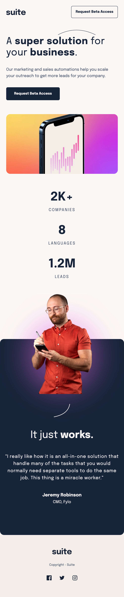

# Frontend Mentor - Suite landing page solution

This is a solution to the [Suite landing page challenge on Frontend Mentor](https://www.frontendmentor.io/challenges/suite-landing-page-tj_eaU-Ra). Frontend Mentor challenges help you improve your coding skills by building realistic projects.

## Table of contents

- [Overview](#overview)
  - [The challenge](#the-challenge)
  - [Screenshot](#screenshot)
  - [Links](#links)
- [My process](#my-process)
  - [Built with](#built-with)
  - [What I learned](#what-i-learned)
- [Author](#author)
- [Acknowledgments](#acknowledgments)


## Overview

### The challenge

Users should be able to:

- View the optimal layout depending on their device's screen size
- See hover states for interactive elements

### Screenshot




### Links

- Live Site URL: [https://suite-landing-page-project.netlify.app]

## My process

### Built with

- Semantic HTML5 markup
- CSS custom properties
- Flexbox
- CSS Grid
- Mobile-first workflow
- CSS utility classes

### What I learned

** CSS Utility classes ** - classes that are attached to the HTML as usual to do a specific thing.
Place the class on any element, as in the example below , the `flex` class is placed on any element that has to be centered and aligned using flex.

```CSS
.d-flex {
  display: flex;
  justify-content: center;
  align-items: center;
}
```


## Author
Daniel Edinam Obuo
Front-End Trainee
Amalitech


## Acknowledgments

Amalitech 


